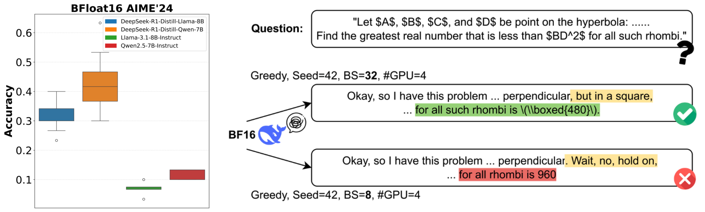

# Give Me FP32 or Give Me Death? Challenges and Solutions for Reproducible Reasoning
## Overview
This repository contains the official implementation of **"Give Me FP32 or Give Me Death? Challenges and Solutions for Reproducible Reasoning"**, published as a preprint on [arXiv](https://arxiv.org/abs/2506.09501). We present the first systematic study on the fragility of LLM reproducibility under different system configurations. Our work identifies reduced numerical precision as a key source of divergence, and introduces LayerCast, a hybrid-precision inference pipeline that balances memory efficiency with numerical stability. 

<p align="center">
  
</p>

<p align="center">
  <i><b>Figure 1.</b> <b>Left:</b> Under BF16 precision and greedy decoding, the model's output can vary significantly depending on factors such as GPU count, evaluation batch size, and GPU hardware version. <b>Right:</b> For example, changes in evaluation batch size alone can lead to noticeable differences in responses, which is often ignored and not standardized by evaluation benchmarks.</i>
</p>

## Environment Setup

```bash
conda create -n reproducible_llm python=3.12 -y
conda activate reproducible_llm
pip install vllm==0.8.2
pip install datasets latex2sympy2 word2number immutabledict nltk langdetect
```
#### Impact of Serving System Version
We consistently used vLLM 0.8.2 for our experiments. Please make sure to use the same vLLM version, since different versions of serving frameworks may employ different GPU kernels, which may have varying numerical stability.


## Getting Started
### To download this repository:
```bash
git clone https://github.com/nanomaoli/llm_reproducibility.git
cd llm_reproducibility
```
### To reproduce the main experiments:
Set CUDA_VISIBLE_DEVICES to control the number of GPUs used, and specify a descriptive exp_name to help track different configurations.
#### Run inference with greedy decoding:
```python
[CUDA_VISIBLE_DEVICES] python eval_main.py --model [MODEL] \
    --task [TASK] \
    --dtype [dtype] \
    --seed [RANDOM_SEED] \
    --batch_size [BS] \
    --max_tokens [MAX_TOKENS] \
    --exp_name [NAME_OF_THE_RUN]
```
Model responses and logprobs will be saved to `outputs/vllm_main/{exp_name}/{model}`. We save logprobs of the 5 most likely tokens for analysis in our paper.
Scoring results will appear in `scoring_results/greedy`.

*Example:*
```python
CUDA_VISIBLE_DEVICES=0,1 python eval_main.py --model deepseek-ai/DeepSeek-R1-Distill-Llama-8B \
    --task math500 \
    --dtype bfloat16 \
    --seed 42 \
    --batch_size 32 \
    --max_tokens 32768 \
    --exp_name 2a100_math500_bf16_bs32
```

#### Run inference with greedy decoding using LayerCast:
LayerCast uses `float32` for computation, so `--dtype` should be set accordingly.
```python
[CUDA_VISIBLE_DEVICES] python eval_layercast.py --model [MODEL] \
    --task [TASK] \
    --dtype float32 \
    --seed [RANDOM_SEED] \
    --batch_size [BS] \
    --max_tokens [MAX_TOKENS] \
    --exp_name [NAME_OF_THE_RUN]
```
Model responses and logprobs will be saved to `outputs/vllm_layercast/{exp_name}/{model}`. 
Scoring results will appear in `scoring_results/greedy_layercast`.
*Example:*
```python
CUDA_VISIBLE_DEVICES=0,1 python eval_layercast.py --model deepseek-ai/DeepSeek-R1-Distill-Llama-8B \
    --task math500 \
    --dtype float32 \
    --seed 42 \
    --batch_size 32 \
    --max_tokens 32768 \
    --exp_name 2a100_math500_layercast_bs32
```


#### Run inference with random sampling (`n` independent samples per problem):

```python
[CUDA_VISIBLE_DEVICES] python eval_passk.py --model [MODEL] \
    --task [TASK] \
    --dtype [dtype] \
    --seed [RANDOM_SEED] \
    --batch_size [BS] \
    --max_tokens [MAX_TOKENS] \
    --passk [n] \
    --exp_name [NAME_OF_THE_RUN]
```
Model responses and logprobs will be saved to `outputs/vllm_passk/{exp_name}/{model}`.
Scoring results will appear in `scoring_results/random_passk`.
*Example:*
```python
CUDA_VISIBLE_DEVICES=0,1 python eval_passk.py --model deepseek-ai/DeepSeek-R1-Distill-Llama-8B \
    --task math500 \
    --dtype bfloat16 \
    --seed 42 \
    --batch_size 32 \
    --max_tokens 32768 \
    --passk 4 \
    --exp_name 2a100_pass4_math500_bf16_bs32
```

## References
Our evaluation implementation is adapted from [SkyThought](https://github.com/NovaSky-AI/SkyThought) repository.